# PopChat

A basic chat application with sharing of images and documents along with text. An additional feature of message request similar to that of facebook's friend request.
- Youtube Demo Video: https://youtu.be/Tiz7vMhNLOY

## Download

## Developer
Gaurav Raj - [LinkedIn](https://www.linkedin.com/in/gaurav-raj-5893b0195/)

## Class and Tier Diagrams
 - Class Diagram 
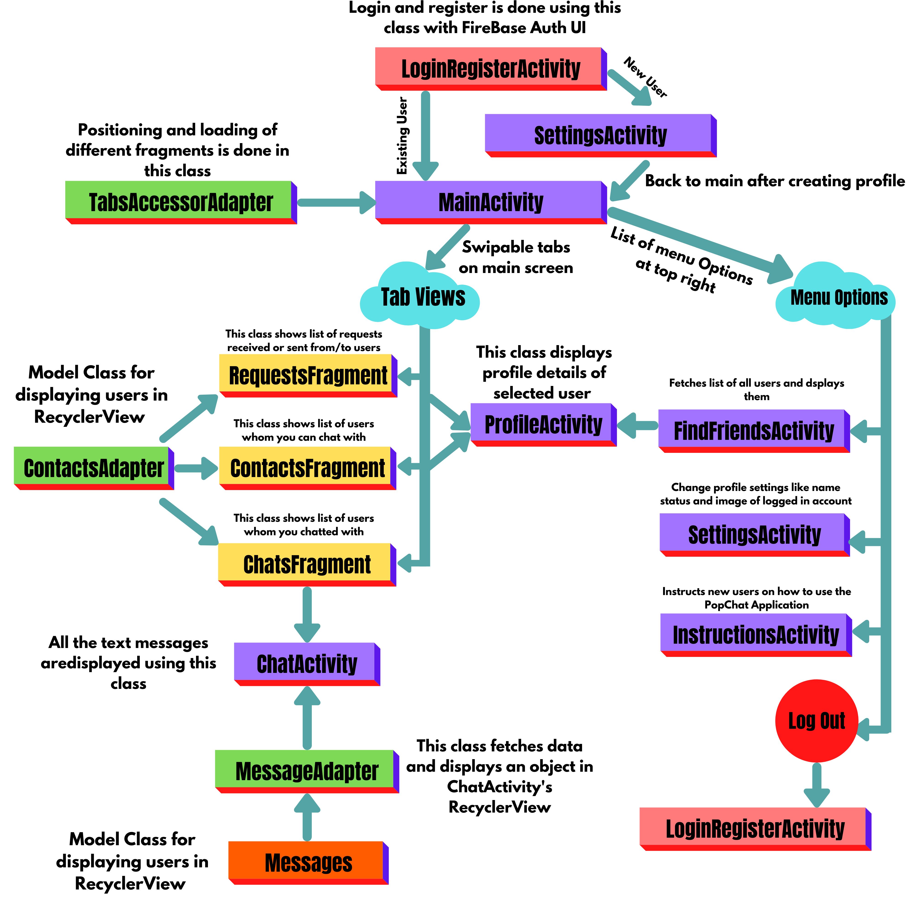
 
 - Tier Diagram
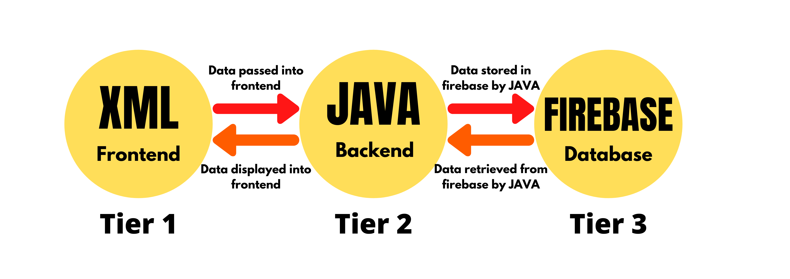

## Features 
 - Chat privately
 - Share images and documents along with text messages
 - Send message requests to connect and start chatting
 - Online sync and Real time updates 
 - Data is saved on cloud hence no internal memory of the phone is used  
 
## Main features of App
- Login Screen 
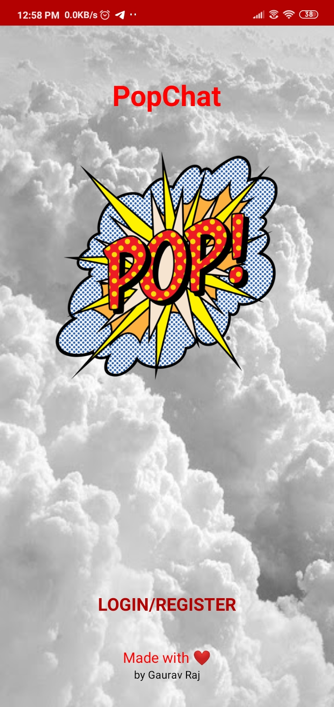

- Login Options 
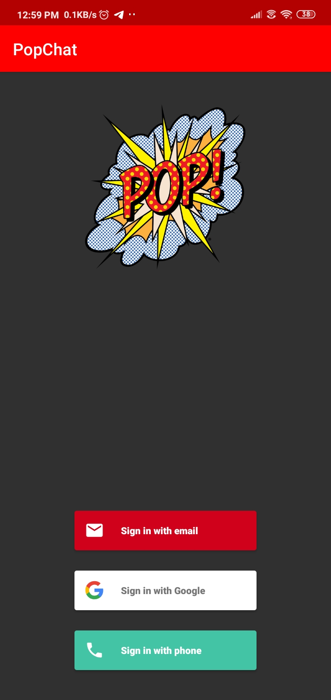

- Set profile image, username and status screen 
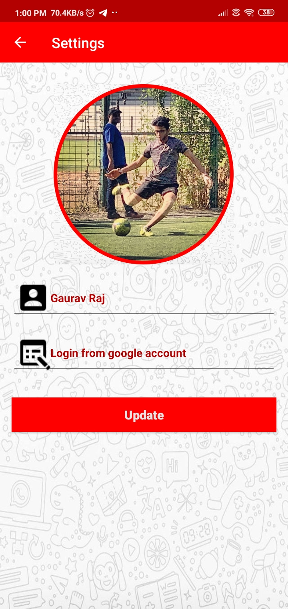

- Basic Instructions 
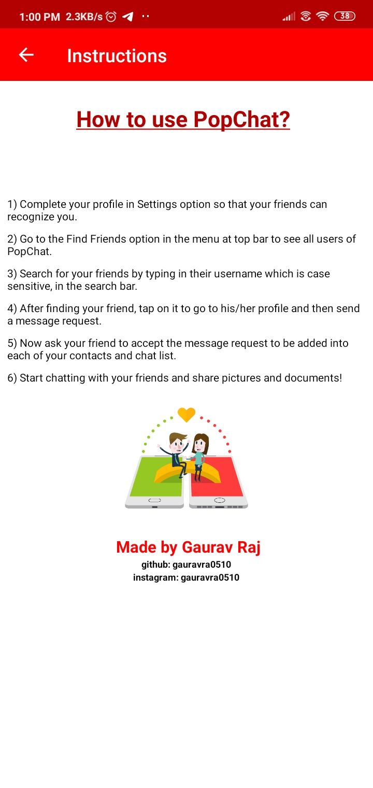

- Find friends to connect 
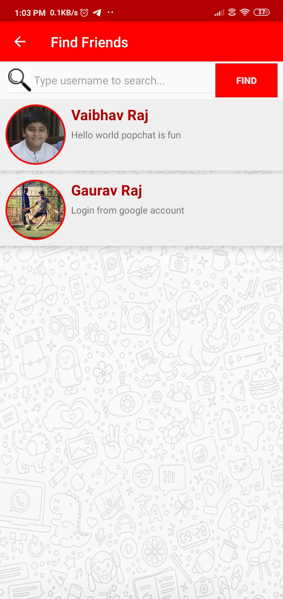

- View their profile and send connection request 
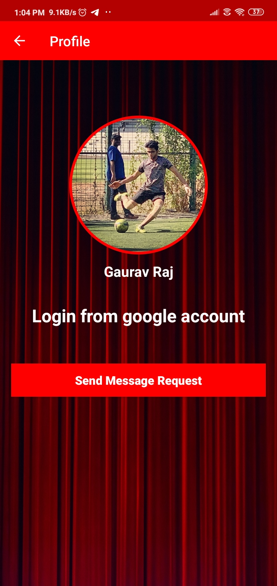

- Accept message request and start chatting 
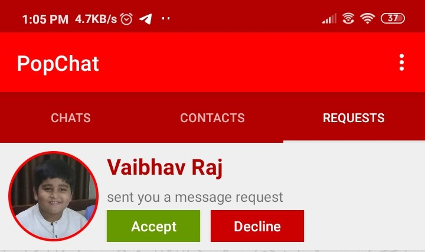

- Chat and share images and documents with your friends 
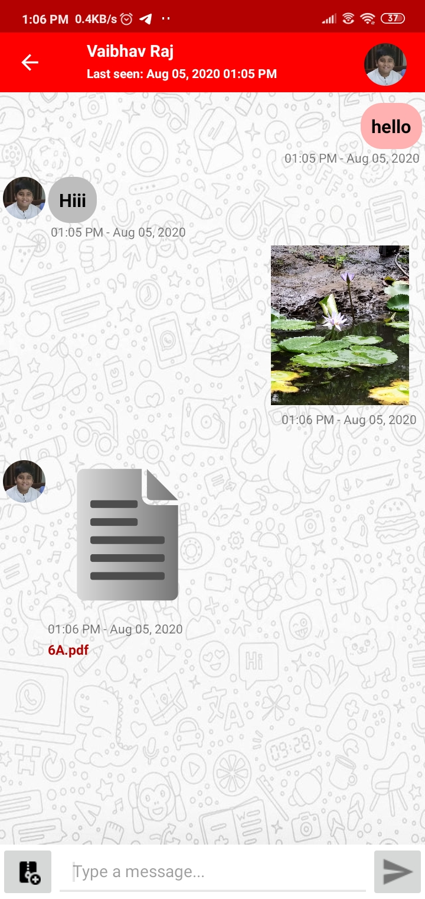

- Online and Last Seen Feature 
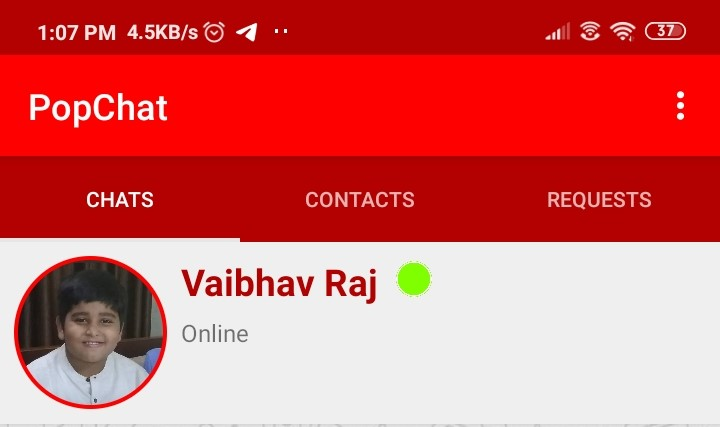
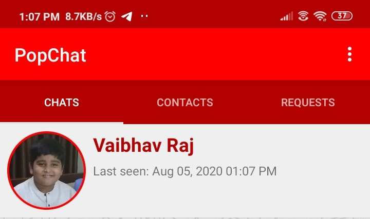
